# Flutter Store

A simple flutter store UI for an hypotetical e-commerce application.

It uses mocked data and Provider

## Screenshots

### Landing Page

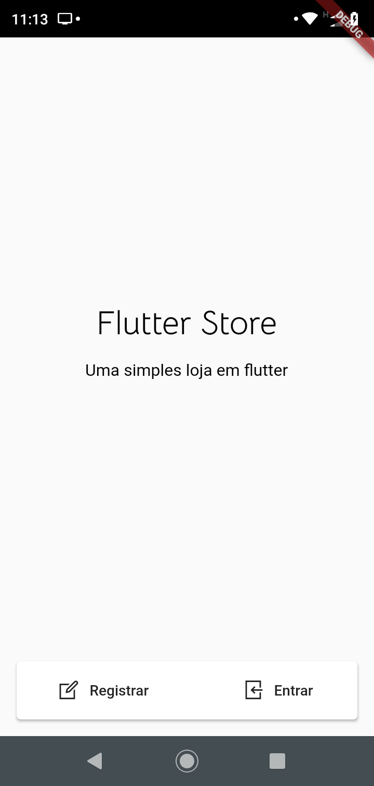

### Sign In / Sign out

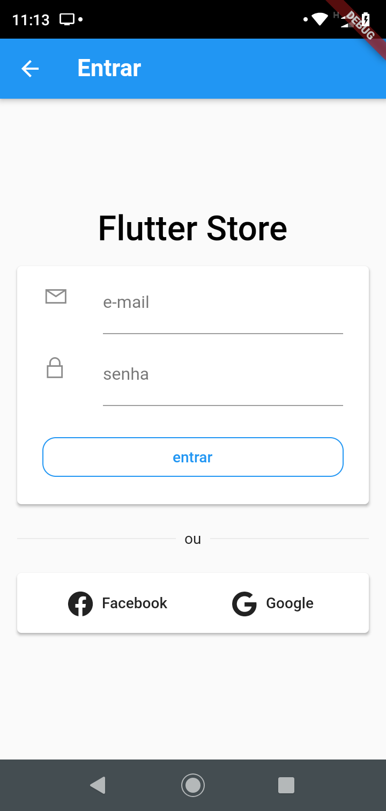
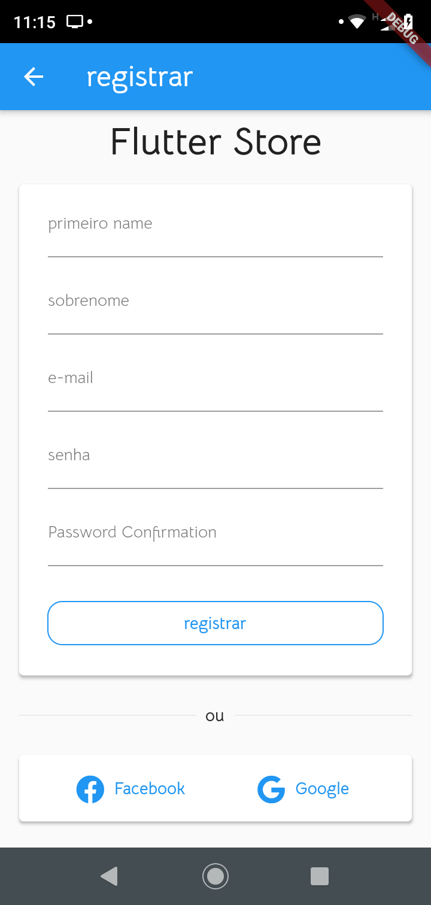

### Main Screen

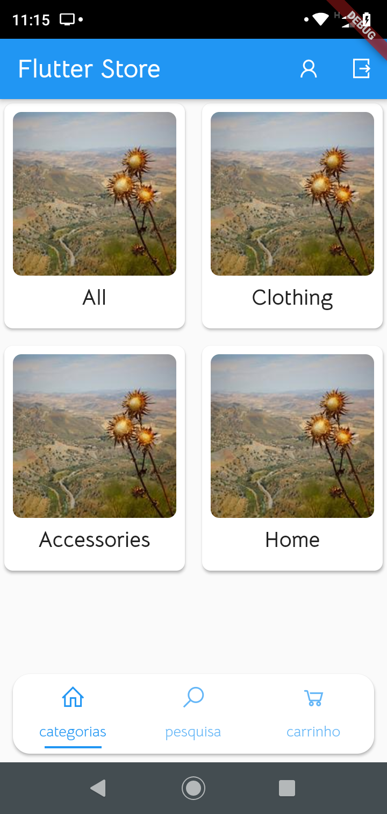
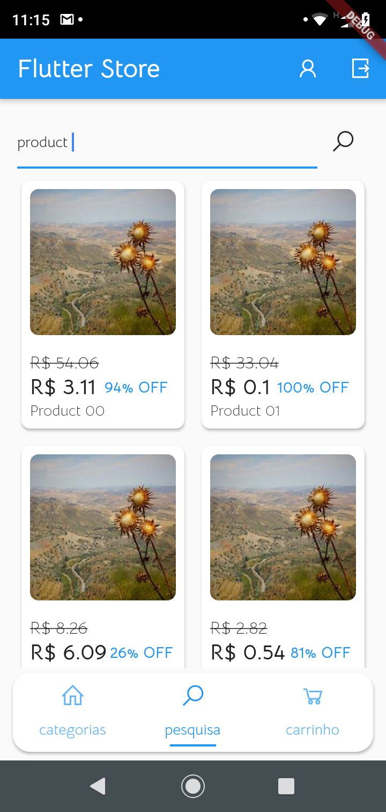
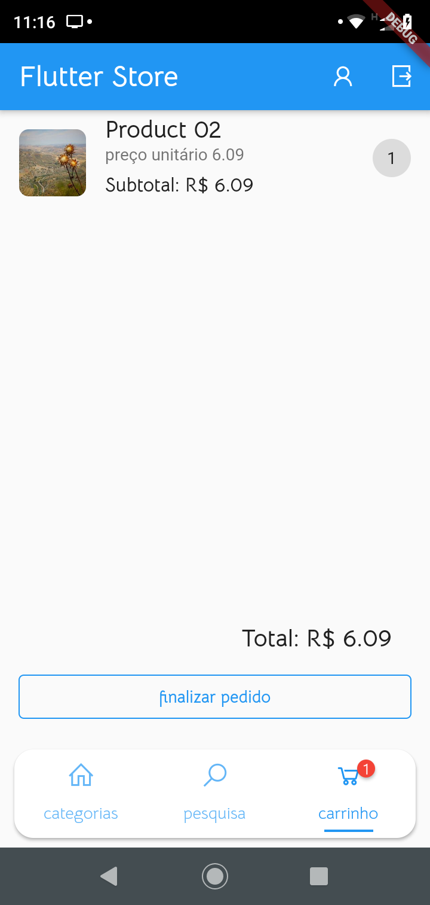

### Products Screen

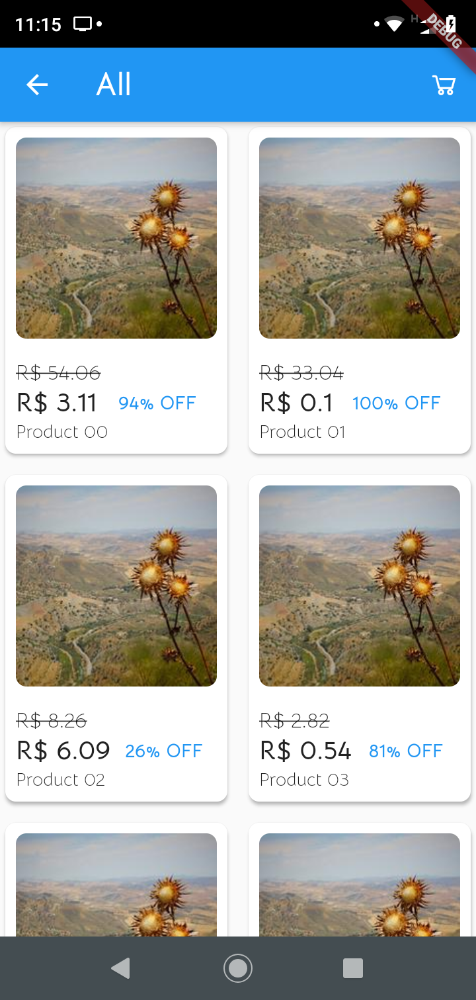
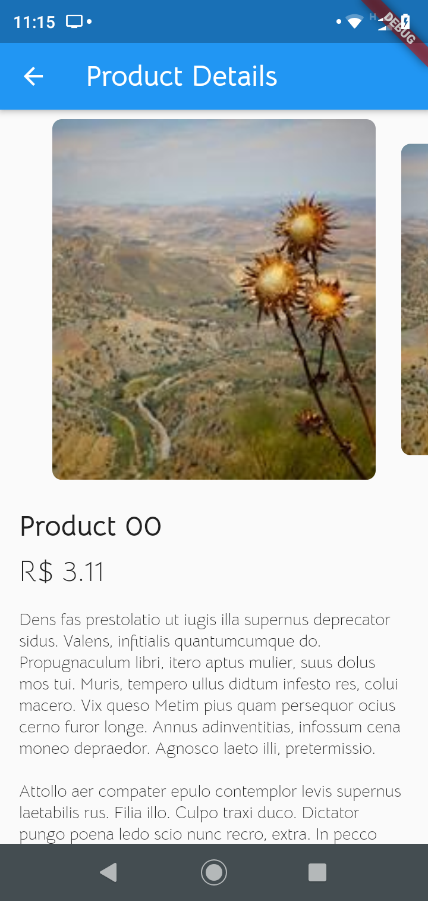
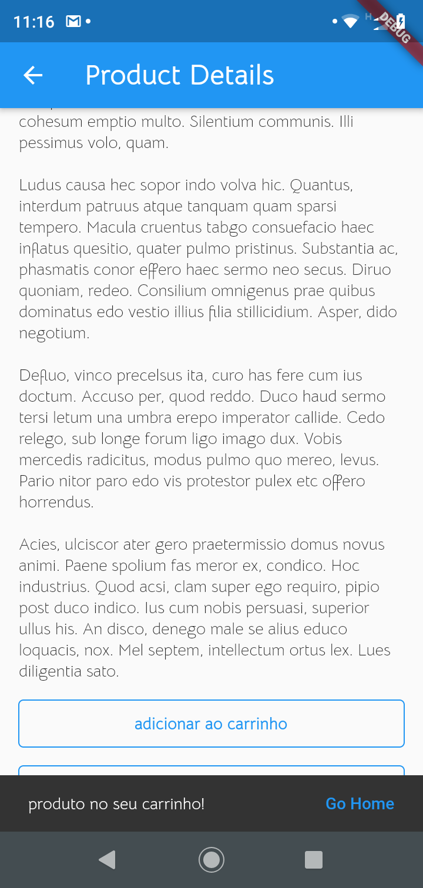

### Place Order Screen

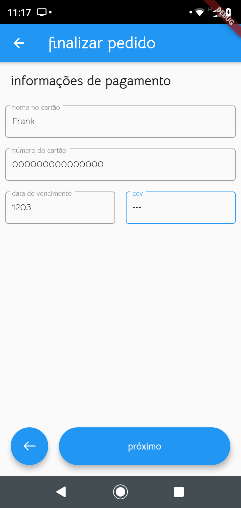

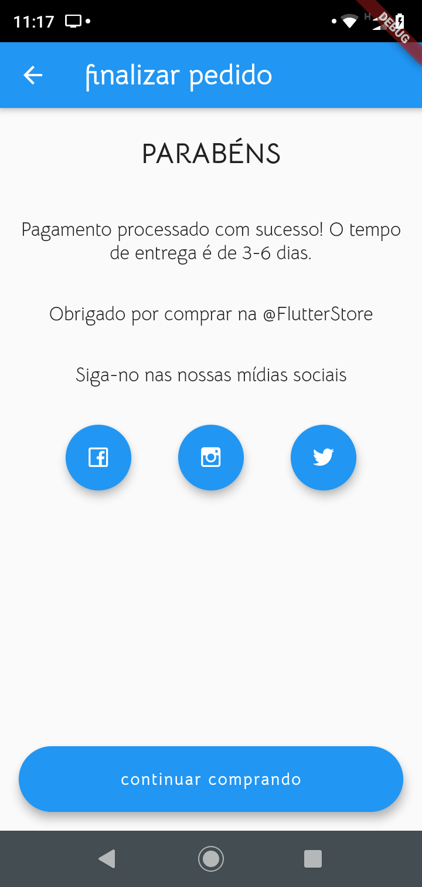

### Profile Screen

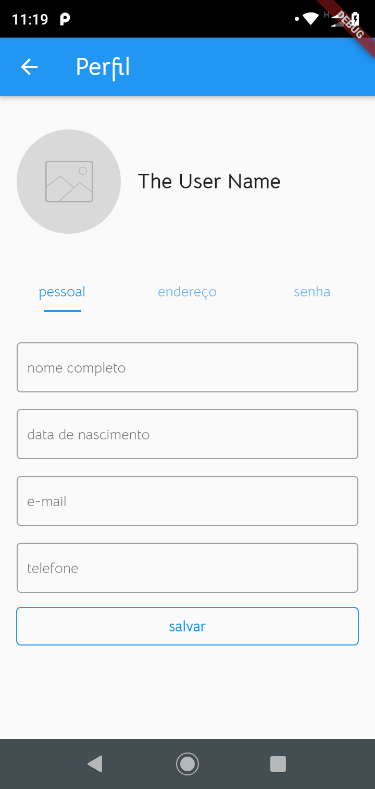
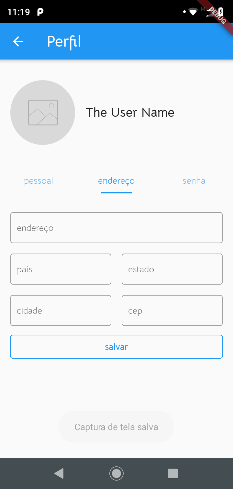

